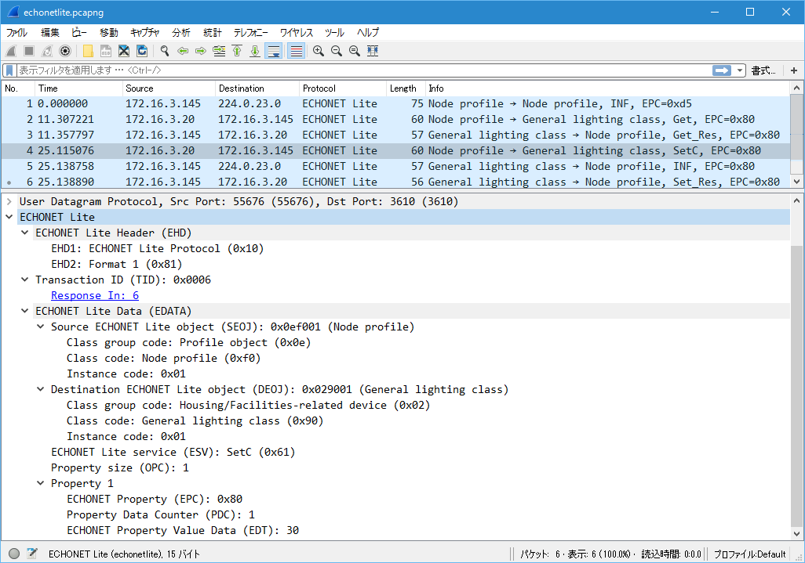

# ECHONET-Lite-dissector
ECHONET Lite プロトコル解析器 for Wireshark

## About ECHONET-Lite-dissector
ECHONET Liteに準拠したUDPによるやりとりを解析しやすくするためのWiresharkプラグインです。
ECHONET Lite バージョン1.12の通信ミドルウェア仕様のやりとりを解釈し、詳細ビューに情報を表示します。

## Usage
Wiresharkのpluginsディレクトリ以下にリポジトリをクローンしてください。
pluginsディレクトリは、以下の場所にあります。

|       OS       | パス
|:--------------:|:-------------------------------
|     Windows    | %AppData%/Wireshark/plugins/
|Linux/OS X/macOS| ~/.config/wireshark/plugins/

以後、勝手に`udp port 3610`でやり取りされるパケットをECHONET Liteとして自動で解釈します。

## Features

ディスプレイフィルタに新たに`echonetlite`が追加されます。ほとんどの場合、`echonetlite`は
`udp port 3610`と等価となります。
`echonetlite`にはフィールドがいくつかあり、ディスプレイフィルタで`echonetlite.edata.esv == 0x73`
などとすることで、ECHONET Lite通信の中からさらに条件で絞り込めるようになっています。
アクセス可能な主なフィールドは以下の通りです。

| ディスプレイフィルタ名       | ECHONET Lite フレームフィールド名
|:------------------------|:------------------------------
| echonetlite.ehd1        | EHD1 (ECHONET Lite電文ヘッダー1)
| echonetlite.ehd2        | EHD2 (ECHONET Lite電文ヘッダー2)
| echonetlite.tid         | TID (トランザクションID)
| echonetlite.edata       | EDATA (ECHONET Liteデータ)
| echonetlite.edata.seoj  | SEOJ (送信元ECHONET Liteオブジェクト指定)
| echonetlite.edata.deoj  | DEOJ (相手先ECHONET Liteオブジェクト指定)
| echonetlite.edata.esv   | ESV (ECHONET Liteサービス)
| echonetlite.edata.opc   | OPC (処理プロパティ数)
| echonetlite.edata.epc   | EPC (ECHONET Liteプロパティ)
| echonetlite.edata.pdc   | PDC (EDTのバイト数)
| echonetlite.edata.edt   | EDT (プロパティ値データ)

このほかにもいろいろとありますが、詳しくはソースコードを読んでください。

## TODO
- [x] クラスグループ名の表示
- [x] クラス名の表示
- [x] ESVの記号の表示
- [ ] EPCのプロパティ名の表示
  - [x] ノードプロファイル
  - [x] 開閉センサー
- [ ] EDTの意味の解釈
  - [x] ノードプロファイル
  - [x] 開閉センサー

## ChangeLog
See [ChangeLog.txt](ChangeLog.txt)

## Lisence
ECHONET-Lite-dissector is licensed under the [MIT](LICENSE) license.

Copyright &copy; 2016, Yuki MIZUNO
